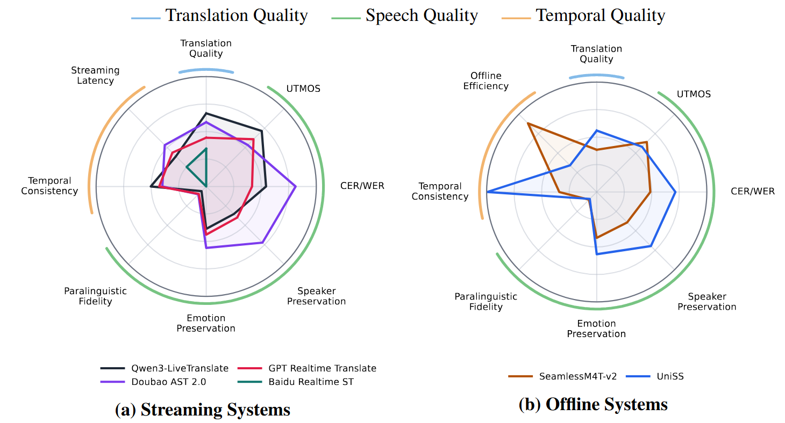

# OpenSTBench

[English](./README.md) | 中文

[](https://arxiv.org/abs/2605.30792)
[](https://pypi.org/project/OpenSTBench/)
[](https://www.python.org/downloads/)
[](LICENSE)
[](https://github.com/sjtuayj/OpenSTBench)
[](https://x-lance.sjtu.edu.cn/)

OpenSTBench 是一个面向语音翻译的多维度评测工具包，适用于异构语音翻译系统，包括语音到文本翻译（S2TT）、语音到语音翻译（S2ST）、离线系统和流式系统。

工具包按三个维度组织评测：

- **翻译质量**：评估译文是否准确表达源语音的语义内容。
- **语音质量**：评估生成语音的自然度、文本一致性、说话人保持、情感保持，以及非语言或副语言事件保持。
- **时序质量**：评估生成语音是否保持合理的时长结构，并在流式系统中评估响应延迟。

## 安装

```bash
pip install OpenSTBench
```

本地开发安装：

```bash
git clone https://github.com/sjtuayj/OpenSTBench.git
cd OpenSTBench
conda create -n openstbench python=3.10 -y
conda activate openstbench
pip install -e .
```

可选依赖：

```bash
pip install "OpenSTBench[comet]"
pip install "OpenSTBench[whisper]"
pip install "OpenSTBench[speech_quality]"
pip install "OpenSTBench[emotion]"
pip install "OpenSTBench[paralinguistics]"
pip install "OpenSTBench[all]"
```

BLEURT 需要单独安装：

```bash
pip install git+https://github.com/lucadiliello/bleurt-pytorch.git
```

## 包名

- PyPI 包名：`OpenSTBench`
- Python 导入名：`openstbench`

## 评测维度

| 维度 | 评测器 | 系统类型 | 主要输出 |
| :--- | :--- | :--- | :--- |
| 翻译质量 | `TranslationEvaluator` | S2TT、S2ST 转写文本 | `sacreBLEU`, `chrF++`, `COMET`, `BLEURT` |
| 语音质量 | `SpeechQualityEvaluator` | S2ST | `UTMOS`, `WER_Consistency`, `CER_Consistency` |
| 语音质量 | `SpeakerSimilarityEvaluator` | S2ST | `average_wavlm_large_similarity`, `average_resemblyzer_similarity` |
| 语音质量 | `EmotionEvaluator` | S2ST | `Emotion2Vec_Cosine_Similarity`, `Audio_Emotion_Accuracy` |
| 语音质量 | `ParalinguisticEvaluator` | S2ST | `Acoustic_Event_Count_F1`, `Acoustic_Event_Localization_F1`, `Acoustic_Event_Onset_Error` |
| 时序质量 | `TemporalConsistencyEvaluator` | S2ST | `Duration_Consistency_SLC_0.2`, `Duration_Consistency_SLC_0.4` |
| 时序质量 | `LatencyEvaluator` | 流式 S2TT/S2ST | `First_Audio_Delay_(StartOffset_ms)`, `Overall_Translation_Delay_(ATD_ms)`, `End_Action_Delay_(CustomATD_ms)`, `Real_Time_Factor_(RTF)` |

离线和流式是系统设置，不是独立的指标维度。请根据系统实际输出选择对应评测器：文本、生成语音、源/目标语音对、事件标注或流式轨迹。

## 实验结果概览

下方雷达图展示了 OpenSTBench 对代表性流式和离线语音翻译系统给出的多维评测视角。该图概括了系统在翻译质量、语音质量和时序质量上的差异：即使系统具有较强的翻译质量，也可能在语音实现、说话人或情感保持、副语言事件保真、时长一致性，以及延迟或效率方面呈现不同表现。



## 论文使用的数据集

论文中使用了以下数据集。使用时请遵守各原始数据集的许可证和访问条款。

| 数据集 | 用途 | 链接 |
| :--- | :--- | :--- |
| MSLT dev | 翻译质量、语音质量、时长一致性、延迟 | [Microsoft Speech Language Translation Corpus](https://www.microsoft.com/en-us/download/details.aspx?id=54689) |
| LibriTTS-based paired speaker set | 说话人保持 | OpenSTBench 构造的 paired set 会通过 [GitHub Releases](https://github.com/sjtuayj/OpenSTBench/releases) 发布；源语料为 [LibriTTS](https://www.openslr.org/60/) |
| RAVDESS | 情感保持 | 使用 RAVDESS Zenodo 记录中的 [Audio_Speech_Actors_01-24.zip](https://zenodo.org/records/1188976) 压缩包 |
| MCAE-SPPS | 情感保持 | [MCAE-SPPS on OSF](https://doi.org/10.17605/OSF.IO/9JYZC) |
| NonverbalTTS test | 副语言/非语言事件保持 | [deepvk/NonverbalTTS](https://huggingface.co/datasets/deepvk/NonverbalTTS) |
| SynParaSpeech | 副语言/非语言事件保持 | [shawnpi/SynParaSpeech](https://huggingface.co/datasets/shawnpi/SynParaSpeech) |

## 快速开始

```python
from openstbench import TranslationEvaluator

evaluator = TranslationEvaluator(
    use_bleu=True,
    use_chrf=True,
    use_comet=False,
    use_bleurt=False,
    device="cuda",
)

scores = evaluator.evaluate_all(
    reference=["我喜欢看电影。", "今天天气很好。"],
    target_text=["我喜欢看电影。", "今天天气很好。"],
    source=["I like watching movies.", "The weather is nice today."],
    target_lang="zh",
)

print(scores)
```

## 示例

完整参数模板放在 `examples/` 中。README 只保留概览；每个示例文件中都列出了可配置参数、输入格式和输出字段。

- `examples/python/translation_eval.py`
- `examples/python/speech_quality_eval.py`
- `examples/python/speaker_similarity_eval.py`
- `examples/python/emotion_eval.py`
- `examples/python/paralinguistic_eval.py`
- `examples/python/paralinguistic_identity_baseline.py`
- `examples/python/temporal_consistency_eval.py`
- `examples/python/latency_eval.py`
- `examples/bash/install_extras.sh`
- `examples/bash/run_latency_cli.sh`

延迟评测也可以通过模块 CLI 运行：

```bash
python -m openstbench.latency.cli --help
```

## 使用约定

- 文本输入通常支持 `list[str]`、每行一个样本的 `.txt` 文件，以及对应评测器支持的 `.json` 文件。
- 音频输入通常支持文件夹、`list[str]`、`.txt` 路径列表，以及对应评测器支持的 `.json` 路径列表。
- 对 `zh`、`ja`、`ko`，语音文本一致性返回 `CER_Consistency`；其他语言返回 `WER_Consistency`。
- 对接受预训练模型来源的评测器，模型来源采用本地优先规则：如果传入的本地路径存在，则使用本地路径；否则回退到配置的远程模型 id。
- 可选依赖只会在对应评测器需要时加载。


## 致谢

- 特别感谢 [SimulEval](https://github.com/facebookresearch/SimulEval)，OpenSTBench 的部分延迟评测组件基于其代码改写
- 感谢 [sacreBLEU](https://github.com/mjpost/sacrebleu)、[COMET](https://github.com/Unbabel/COMET)，以及 [bleurt-pytorch](https://github.com/lucadiliello/bleurt-pytorch)；其中 bleurt-pytorch 是 [BLEURT](https://github.com/google-research/bleurt) 的 PyTorch 移植版本，用于翻译质量评测
- 感谢 [Whisper](https://github.com/openai/whisper)、[SpeechMOS/UTMOS](https://github.com/tarepan/SpeechMOS)、[Resemblyzer](https://github.com/resemble-ai/Resemblyzer) 和 [WavLM](https://github.com/microsoft/unilm/tree/master/wavlm)，用于语音质量和说话人相似度评测
- 感谢 [FunASR](https://github.com/modelscope/FunASR) 和 [Emotion2Vec](https://modelscope.cn/models/iic/emotion2vec_plus_large)，用于情感保持评测
- 感谢 [CLAP](https://huggingface.co/laion/clap-htsat-fused) 和 [Hugging Face Transformers](https://github.com/huggingface/transformers)，用于副语言事件评测

## 引用

如果您觉得我们的工作有帮助，请引用：
```bibtex
@misc{an2026openstbenchsemanticevaluationspeech,
      title={OpenSTBench: Beyond Semantic Evaluation for Speech Translation}, 
      author={Yanjie An and Yuxiang Zhao and Yichi Zhang and Qixi Zheng and Yujie Tu and Keqi Deng and Kai Yu and Xie Chen},
      year={2026},
      eprint={2605.30792},
      archivePrefix={arXiv},
      primaryClass={eess.AS},
      url={https://arxiv.org/abs/2605.30792}, 
}
```

## License

OpenSTBench 的原创代码以 MIT License 发布。详见 [LICENSE](LICENSE)。

部分延迟评测组件包含改写自 [SimulEval](https://github.com/facebookresearch/SimulEval) 的代码。SimulEval 使用 Creative Commons Attribution-ShareAlike 4.0 International License（CC BY-SA 4.0）。这些改写部分按照 CC BY-SA 4.0 发布。详见 [THIRD_PARTY_NOTICES.md](THIRD_PARTY_NOTICES.md)。

OpenSTBench 引用的数据集，包括论文中使用的数据集，不包含在 OpenSTBench 代码许可证范围内。这些数据集由其原始作者或发布方按照各自的许可证和使用条款提供。其中部分数据集仅限研究或非商业用途。
